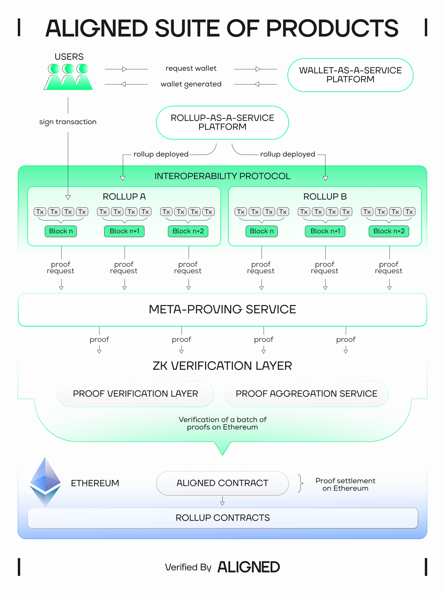

# About Aligned

## What is Aligned?

Aligned is a vertically integrated stack for building applications on a verifiable internet. Whether it's financial infrastructure or AI systems, we provide the foundation for provable execution with one-click solutions for wallets, rollups, interoperability, and ZK services in a world where trust is no longer a given.

## Mission

Aligned is creating the foundation for a trustless, verifiable internet. Our vertically integrated stack empowers developers to build applications across finance, AI, and other sectors with one-click solutions for wallets, rollups, and zero-knowledge services on Ethereum. We’re focused on enabling provable execution in a world where institutional trust is increasingly fragile.

By providing the tools for trust to be integrated into every layer of application infrastructure, we’re enabling developers to create verifiable systems that can be trusted across a wide range of use cases. Aligned is here to enable a future where trust is not assumed, but proven by design.


If you are unfamiliar with ZK and why this is useful, see [Why ZK and Aligned?](3_why_zk.md)


## What real value does Aligned bring to the table?

Aligned is building a full stack of vertically integrated infrastructure designed to make it easier for teams to launch, operate, and scale on Ethereum.

Aligned suite of products and services includes:

- ZK Verification Layer (the Proof Aggregation Service)
- Rollup-as-a-Service (RaaS) Platform
- Meta-Proving Services
- Interoperability Protocol
- Wallet-as-a-Service

Read more: [The Aligned Roadmap](https://roadmap.alignedlayer.com) and [the Aligned Manifesto](https://blog.alignedlayer.com/aligned-manifesto/)

By vertically integrating our stack we can provide the best developer experience and highest performance at the lowest possible cost.

- Fully open-source—no proprietary code or licenses
- Simplicity and minimalism—easy to maintain
- Modular and flexible—customizable to meet your business needs
- Future-proofed—designed to support emerging technologies

Whether you’re a seasoned crypto builder or an enterprise launching your first blockchain project, Aligned gives you the tools to deploy powerful Ethereum-native infrastructure without compromising on security, performance, or flexibility.

As Ethereum continues to be adopted as the financial backend of the internet, we are committed to helping developers and companies tap into its security and global, 24/7 liquidity.

## What limits the development of more complex applications on top of blockchains?

The main limitation for building complex applications on top of blockchains has been that the computation can run only a few milliseconds on-chain, and even then, this can be costly. You can't have millions of daily active users using Ethereum or any blockchain at the same time.

ZK solves this, but due to slow and complex-to-use proving and expensive verification, progress has been limited. In the case of proving, before the development of general-purpose zero-knowledge virtual machines (zkVMs), users had to express their computation as arithmetic circuits, making the developer experience something like coding in assembler, error-prone, and complex. Moreover, proof systems depended on trusted setups, adding additional trust guarantees, the need to carry out special ceremonies to initialize parameters, and delaying go-to-market times. Besides, having high verification costs (on the order of 10's to 100's of dollars per proof) meant that only those projects with a huge capital could afford to build such applications.

## How much can Aligned’s ZK Verification Layer reduce costs?

Aligned’s ZK Verification Layer is the Proof Aggregation Service. The cost reduction depends on throughput and the number of proofs aggregated together: the cost of verifying the aggregated proof on Ethereum is amortized across every proof in it, so the more proofs are aggregated, the cheaper each one becomes.

## How does Aligned’s stack compare to other solutions?

Aligned's Proof Aggregation Service compresses many proofs into a single recursive proof that is verified directly on Ethereum. Because the final proof is checked by an Ethereum smart contract, it inherits the full cryptographic security of Ethereum — there is no separate trust assumption to reason about, and no new economic security to bootstrap.

Other solutions focus on building a separate L1 for proof verification, which sets them apart from Ethereum and requires bootstrapping economic security that can be subject to volatility. Another key feature is that Aligned's approach is stateless, simplifying the process greatly.

## Why is Aligned building its stack?

Aligned is building its stack to provide the foundational infrastructure for a trustless, verifiable internet. Aligned’s vertically integrated stack empowers developers to build applications across industries like finance and AI, offering one-click solutions for rollups, wallets, and several zero-knowledge (ZK) services.

In recent months, we have witnessed the development and enhancement of general proving virtual machines such as Risc0, Valida, Jolt, and SP1. These innovations allow users to write ordinary code in languages like Rust or C and generate proofs demonstrating the integrity of computations. This evolution is poised to transform application development, provided we have verification networks with high throughput and low cost. This is the core vision of Aligned and the reason we are building it: the future belongs to provable applications.

Currently, proof verification in Ethereum is expensive and throughput is limited to around 10 proofs per second. The cost depends on the proof system used, and the availability of precompiles. Groth16 costs around 250,000 gas, STARKs, over 1,000,000, and other proof systems are too expensive to be used in Ethereum.

Proof technology has been evolving over the last decade, with new arguments, fields, commitments and other tools appearing every day. It is hard to try new ideas if verification costs are high, and there is a considerable go-to-market time, as a consequence of development time of new, gas-optimized smart contracts, or the inclusion of new precompiles to make them affordable.

Aligned’s stack provides an alternative to reduce costs and increase throughput significantly. This is achieved by the Proof Aggregation Service.

The Proof Aggregation Service enables cost-efficient ZK proof verification by combining multiple proofs into one using recursive proof aggregation. Users submit their proofs to the service, which aggregates them into a single recursive proof attesting to the validity of all of them, and verifies that proof on Ethereum. The cost of the on-chain verification is then amortized across every proof in the batch.

Because the final proof is verified by an Ethereum smart contract, this achieves Ethereum's full security. It is ideal for services like rollups that require Ethereum's full security but can tolerate higher latency.

To complement these verification capabilities, Aligned’s Meta-proving Services offers an easy interface for accessing centralized and decentralized proving from external providers. Many developers building programs on Aligned with zkVMs will want to delegate proving to different service providers. To address this, we will have a simple SDK that allows developers to code in Rust and easily send their programs for proving to their preferred services.

Aligned’s stack also provides a one-click solution for wallets and rollups. With Aligned’s Wallet-as-a-service infrastructure, developers can easily generate embedded wallets for users, supporting rollups and mobile integrations. It will leverage the latest account abstraction technology, offering seamless wallet services backed by our robust tech stack. And rollups Aligned's RaaS platform simplifies ZK-rollup deployment, allowing clients to launch L2 chains without needing deep blockchain expertise. It streamlines the process for developers and is also adding support for based rollups, a crucial element of Ethereum’s roadmap.

As a key component of Aligned’s vision, Aligned’s Interoperability Protocol will offer an intent-based bridge that will be integrated with our RaaS stack. It will leverage based sequencing and enable developers to create native trust-minimized solutions for users and financial institutions to efficiently move liquidity across chains.
With each of these products, we are taking concrete steps toward fulfilling our mission of building a trustless and verifiable internet. By providing developers with the tools to create scalable, efficient, and secure applications, Aligned is tackling the fundamental challenges of trust that have long hindered the potential of blockchain and decentralized technologies.

## Future additions

- Propagation of the results to different L2s
