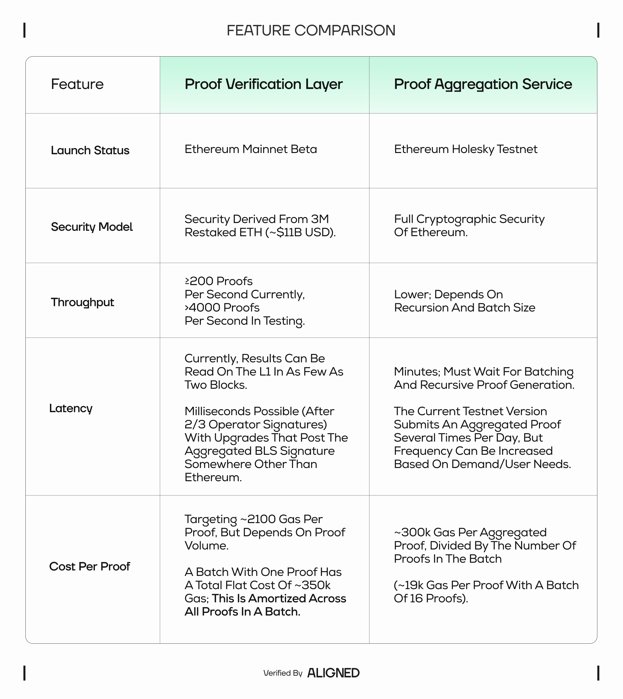

# Use Cases: ZK Verification Layer

Aligned’s ZK verification layer for Ethereum makes proof verification affordable, fast, and scalable—either via our low-latency [Proof Verification Layer](https://docs.alignedlayer.com/architecture/1_proof_verification_layer) (an EigenLayer AVS) or via our recursive [Proof Aggregation Service](https://docs.alignedlayer.com/architecture/2_aggregation_mode). Use Aligned when you need to verify many proofs, expensive proofs, or proofs that aren’t economical in the EVM, and you still want results settled to Ethereum.

The ZK verification layer can be useful anytime ZK is used with Ethereum, but some clear use cases are described in this section.

## ZK-rollups and Ethereum scaling

Rollups produce ZK proofs of state transitions and need to verify (settle) those results on Ethereum. Verification can cost ZK-rollup operators millions per year, and infrequent verification to save on gas leads to longer exit windows and worse UX.

### **How Aligned helps:**

- Offloads verification to a decentralized operator set, reducing per-proof gas by 90–99% and increasing throughput from ~tens of proofs/sec on Ethereum to thousands.  
- For full L1 security and no cryptoeconomic trust assumptions, aggregate many rollup proofs into a single recursive proof verified on Ethereum.  
- Option to use the Proof Verification Layer or Proof Aggregation Service depending on security and latency needs.

### **Choose a mode:**

- **Verification Layer (low latency, high volume):** live on mainnet; ideal for the fastest confirmations and very high proof volumes. Economic security with nearly 3 million restaked ETH (>$12B USD value).  
- **Aggregation Service (highest security):** recursively compresses many proofs into one proof verified on L1; great when you can trade latency for full Ethereum security.


Our RaaS makes launching [based ZK-rollups](https://blog.alignedlayer.com/aligned-raas-based-rollups-to-build-the-future-of-ethereum/) (Ethrex stack) possible in one click and is integrated with our ZK verification layer to reduce costs.


## Fast, trust-minimized bridging & interoperability

Bridges and cross-chain systems verify source chain state/account proofs on the destination chain. We are also developing an intents and ZK-based fast interoperability protocol in-house to take full advantage of the ZK Verification Layer and to complement our RaaS platform.

### **How Aligned helps:**

- Verifies non-EVM-friendly proofs (e.g., Kimchi, STARKs) economically and at scale.  
- Enables fast exits (soft finality) while optionally posting hard-finality checkpoints via aggregation.

### **Choose a mode:**

- **Verification Layer** for quick attestations and user UX.  
- **Aggregation Service** for periodic consolidated checkpoints to L1.


The Mina ↔ Ethereum bridge uses Aligned to verify Mina’s Kimchi proofs on Ethereum ([blog post](https://blog.alignedlayer.com/mina-to-ethereum-bridge/)).


## zkTLS & web2-to-web3 data credentials

Generate proofs about data fetched over TLS (bank account balances, KYC, social graphs) and use them onchain without revealing the raw data.

### **How Aligned helps:**

- Turns high-volume zkTLS attestations into a practical UX by keeping verification costs low and parallelizable.  
- Lets apps pick latency vs. finality per flow (e.g., instant gating on Verification Layer + periodic L1-final checkpoints via aggregation).

### **Choose a mode:**

- **Verification Layer** when users need instant attest-and-act.  
- **Aggregation Service** when proofs must be verified directly on Ethereum.

## Verifiable AI (zkML / LLM inference proofs)

To make AI verifiable, prove that model inference (or parts of a pipeline) ran correctly, or that an output meets policy constraints—then settle the result to Ethereum for auditability or onchain automation.

### **How Aligned helps:**

- zkVM proofs from systems like SP1 and Risc0 are supported today, so you can move from POCs to production-grade verification economics.  
- High-volume inference checks (micro-payments, agent marketplaces, model-usage attestations) benefit from the Verification Layer’s low latency; compliance/events can use aggregated L1 proofs.

### **Choose a mode:**

- **Verification Layer** for per-inference confirmations and low cost at scale.  
- **Aggregation Service** for periodic, L1-final attestations (e.g., job batches, epoch summaries).


See our [blog post](https://blog.alignedlayer.com/the-era-of-ai-needs-ethereum-and-zk/) that expands on why we believe ZK and Ethereum will play a major role in the future of AI.


## Identity & verifiable credentials

Issue/verify privacy-preserving credentials (DID/VC, age/eligibility proofs, reputation). Governments and enterprises can adopt ZK without forcing users to leak data.

### **How Aligned helps:**

- Makes credential verification cheap enough for mainstream UX while keeping Ethereum as the root of trust and avoiding the compromise of verifying proofs on a blockchain with lower security.  
- Already powering real identity stacks (e.g. [Sovra’s Digital Trust Stack](https://blog.alignedlayer.com/aligned-sovra-partner-to-power-digital-trust-in-latin-america/)).

### **Choose a mode:**

- **Verification Layer** for interactive UX (logins, access control).  
- **Aggregation Service** for archival or cross-period consolidated attestations.

## ZK coprocessors & oracles

Off-chain processes fetch data or perform heavy computations and return a ZK proof that onchain logic can trust. Allows offchain computation to be secured by onchain trust, giving smart contracts greater expressivity.

### **How Aligned helps:**

- Lets you run richer computations and affordably verify them onchain.  
- A natural way to add computational trust and reduce L1 gas bottlenecks for oracle-like systems.

### **Choose a mode:**

- **Verification Layer** for frequent or streaming tasks.  
- **Aggregation Service** when the highest security is needed (e.g. if the economic security from the AVS does not meet risk management parameters).

## Onchain gaming & interactive apps

Games and interactive dapps that prove game validity, scores/results, or anti-cheat logic with ZK.

### **How Aligned helps:**

- Low-latency verification makes regular and frequent proving economical.  
- We’ve highlighted early builders in our [hackathon spotlights](https://blog.alignedlayer.com/tag/hackathons/).


_**Coming soon:**_ Our **ZK Arcade** (launching 2025 Q3) will let users verify proofs of game results using Aligned.


## Which mode should I pick?

**Need the lowest cost and fastest confirmations?**
- Start with the [Proof Verification Layer](https://docs.alignedlayer.com/architecture/1_proof_verification_layer). It’s live on mainnet, secured by 52 restaked operators, and can verify thousands of proofs per second with results readable on Ethereum within blocks (cryptoeconomic security derived from Ethereum).

**Need full L1 finality in one transaction?**
- Use the [Proof Aggregation Service](https://docs.alignedlayer.com/architecture/2_aggregation_mode). It recursively compresses many proofs into one that’s verified directly on Ethereum, trading minutes of latency for the strongest security (full cryptographic security of Ethereum).

***You can also combine both:*** use the Verification Layer for UX and fast exits, then periodically post aggregated checkpoints for L1 finality.

In the current Holesky testnet deployment of the Proof Aggregation Service, supported Risc Zero and SP1 zkVM proofs that are submitted to the Proof Verification Layer are aggregated and verified through the Aggregation Service several times per day. The mainnet version will allow users to choose either the Verification Layer or Aggregation Service (or both) when submitting proofs.

## Supported proof systems

Aligned supports multiple verifiers (today: Risc0, SP1, gnark Groth16/Plonk, Circom, with more on the roadmap), so you can pick the right proving stack and still get good economics.

## Featured projects & posts

- [Verification Layer vs. Aggregation Service deep-dive](https://blog.alignedlayer.com/proof-verification-layer-vs-aggregation-service/)  
- [Aligned RaaS: Based ZK-rollups using Ethrex](https://blog.alignedlayer.com/why-is-aligned-using-ethrex-for-based-zk-rollups/)  
- [Mina ↔ Ethereum bridge](https://blog.alignedlayer.com/mina-to-ethereum-bridge/)  
- [Why based rollups?](https://blog.alignedlayer.com/aligned-raas-based-rollups-to-build-the-future-of-ethereum/)

## Future additions

- Use cases: Aligned RaaS
- Use cases: Meta-proving services
- Use cases: Aligned Wallets-as-a-Service
- Use cases: Aligned Interoperability protocol
