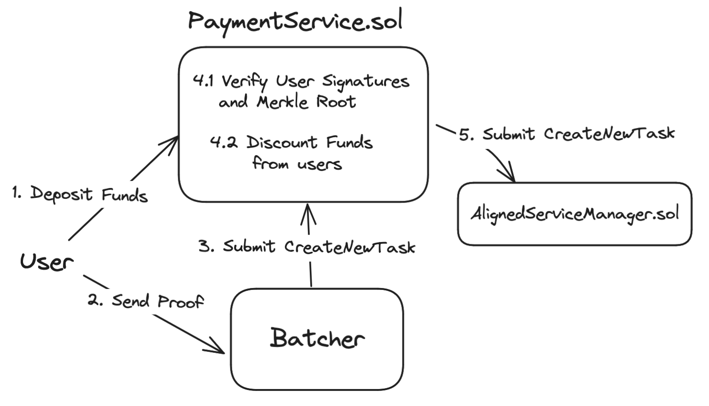

# Payment Service

The Payment Service handles users payments to fund the verification of their proofs.

To be able to use the batcher, a user must fund its transactions.
For this, there is a simple Payment Service.

The Batcher has an associated `Batcher Payments` smart contract,
which is in charge of receiving user's payments,
and it guarantees that it can only spend these funds to send users' proofs to Aligned.

Users must first deposit into this contract, via a normal transfer to its address,
where the Batcher Payment System will update the User's balance.

Users send proofs to the Batcher, which checks whether there are enough funds.
Once a batch is complete, the Batcher calls its smart contract with the collected user data

The smart contract deducts funds from senders' balances and creates a new Batch in
the [Aligned Service Manager](./3_service_manager_contract.md),
including funds for batch verification payment to the [Aggregator](./5_aggregator.md).

Users can then withdraw extra funds deposited to the Batcher Payments smart contract,
or leave them to fund future proofs.
To avoid causing a Denial of Service on the Batcher, Users must first call the contract's `unlock` function,
and then call `withdraw` at least 100 blocks later, to finish their withdrawal process.
This enables the Batcher to be sure the User will have funds to pay for his proofs when `createNewTask` is called.

This way, the Batcher can only use the User's funds to pay for the verification of the User's proofs. The Batcher Payment Service guarantees that the Batcher will not be able to spend the user funds for anything other than submitting the user's proofs to Aligned.

## Payment service architecture and flow



## Details of the contract

### API

#### Receive funds

```solidity
    receive() external payable
```

This function will be called every time a User transfers funds to the smart contract.
It will not only receive the funds, but it will also register internally how much the User deposited,
to keep track of each User's funds separately.

#### Create New Task

```solidity
function createNewTask(
    bytes32 batchMerkleRoot,
    string calldata batchDataPointer,
    address[] calldata proofSubmitters,
    uint256 feeForAggregator,
    uint256 feePerProof,
    uint256 respondToTaskFeeLimit
) external onlyBatcher whenNotPaused
```

This function is called only by the Batcher when it has a batch ready to be submitted to Aligned.
It contains all the information needed to post the batch
in the [Aligned Service Manager](./3_service_manager_contract.md) (`batchMerkleRoot`
and `batchDataPointer`), plus an array containing which are the `proofSubmitters`, to discount `feePerProof` from
these, and also the `feeForAggregator`, declaring how much will need to go pay for the response of the batch, as well
as the `respondToTaskFeeLimit`, a safeguard that sets the max quantity of Ethereum that the aggregator should spend in
case of a gas price spike.

#### Unlock

```solidity
    function unlock() external
```

Any user can call this function to unlock its funds for withdrawal after 100 blocks.

Note that if the user funds are unlocked, the batcher will reject any new proofs from this user until the funds are
locked again.

#### Lock

```solidity
    function lock() external
```

Any user can call this function to lock its funds again after unlocking.

#### Withdraw

```solidity
    function withdraw(uint256 amount) external
```

Any User can call this function to withdraw any amount of their available balance from the contract,
only when their funds are unlocked.
