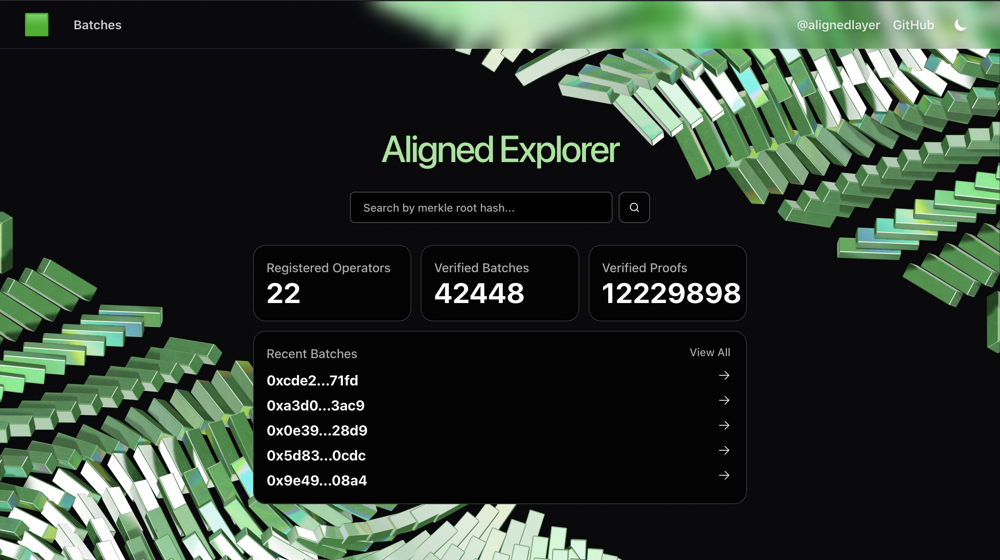
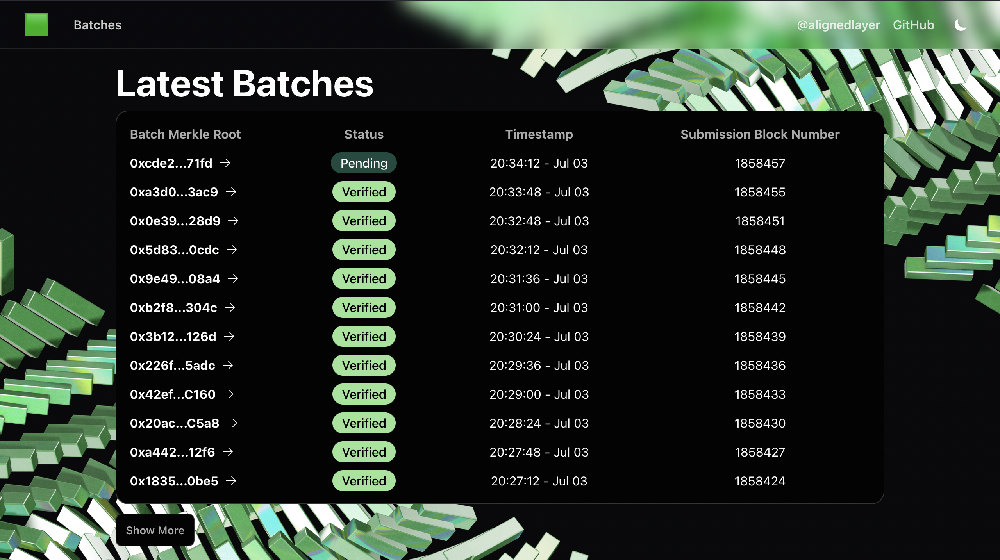
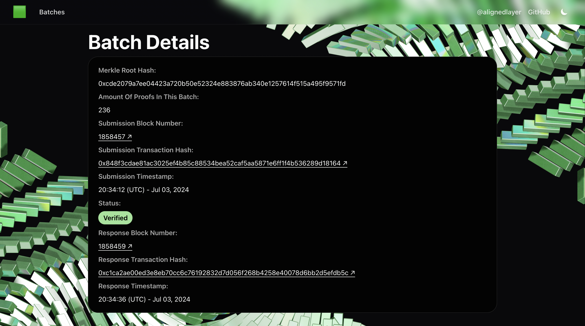
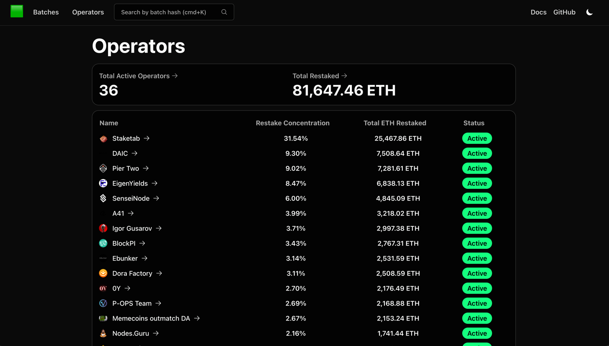
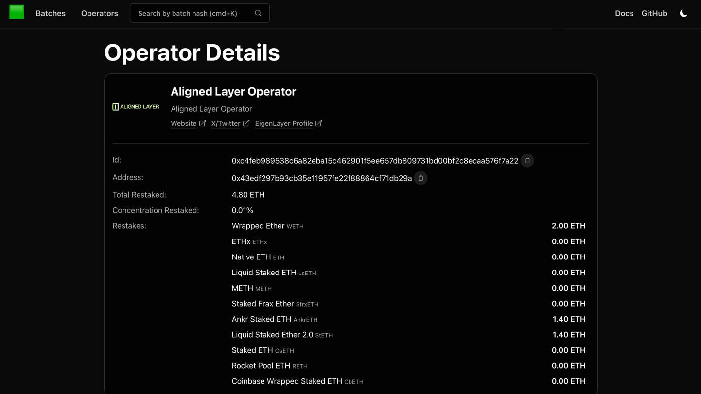
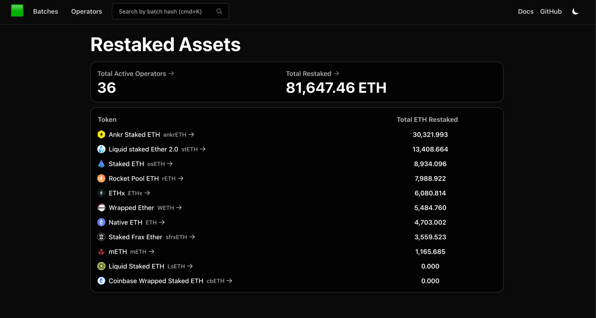
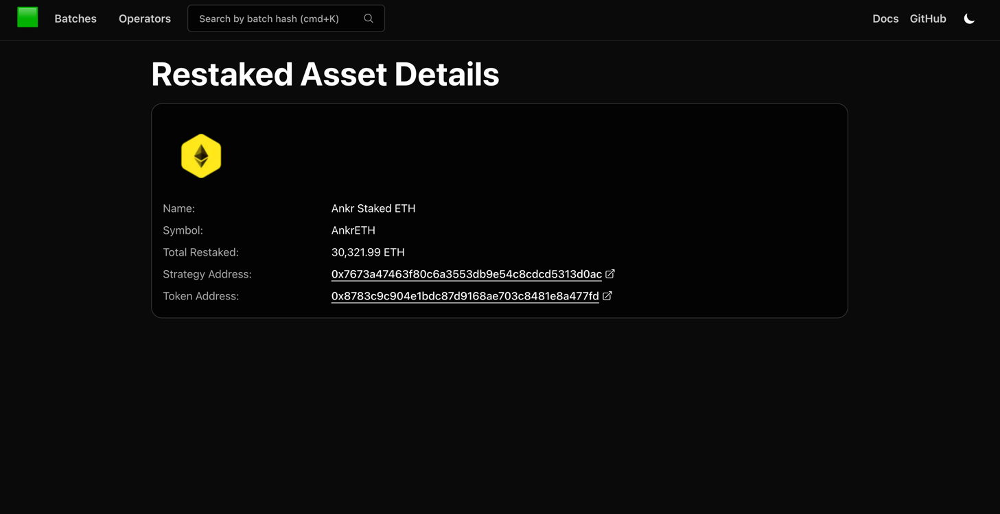

# Explorer



The Explorer keeps track of [Aligned Service Manager](./3_service_manager_contract.md).

It has an internal state of previous batches, actively listens for new batches and their responses. The Explorer then displays this information for Users to visualize the submitted batches, their states and more useful information in real time.

In the landing page,
we can see information such as how many [Operators](./4_operator.md) are currently registered and active,
total ETH restaked by said Operators, how many Batches and how many total Proofs have been verified.

The main Aligned contracts such as the Aligned Service Manager or the Batcher Payment Service are easily accessible 
from the Explorer with links to etherscan.

From here, we can search for a specific batch by its Merkle Root or even find a batch, or if you want to find which batch contains a specific proof, you can also search by proof hash.
We can also directly jump to any one of the last 5 submitted batches, and we can easily go to the `Batches` page, 
where we can navigate through the various pages of batches of proofs submitted to aligned, ordered by latest submission, 
and easily check their on-chain status, timestamp, and block number.

We can also click any individual batch hash to view its details.

From the details view, we can visualize:

- The `Batch Hash` Merkle Root and a copy to clipboard button
- The batch's `Status`, either `Pending` or `Verified`
- `Batcher Sender Address` which is the address of the batcher that submitted the batch
- `Number of Proofs in this Batch`, the number of proofs included in the batch
- `Fee per Proof`, fee paid per proof in the batch in ETH and USD
- `Proofs in the Batch`, which when pressed will show a list of all the proof hashes included in the batch
- Ethereum's `Submission Block Number`, linked to etherscan
- `Submission Transaction Hash`, linked to etherscan
- `Submission Timestamp` of the batch
- Ethereum's `Response Block Number`, linked to etherscan
- `Response Transaction Hash`, linked to etherscan
- `Response Timestamp` of the batch
- Lastly, if the batch is `Verified`, we can see a small X Post button that lets us easily share on X that the batch has been verified.

The `Operators` page shows a list of all registered operators,
their restake concentration in %, the total amount of ETH they have restaked and their status.

These are ordered by the amount of ETH restaked, with the top operator being the one with the most ETH restaked.

When hovering over an operator, we can see the operator's address and id.

The `Operator Details` page shows the operator's id, address, total ETH restaked, 
restake concentration in %, and the assets restaked order by the amount of ETH restaked.

The Operators image is also displayed, and we access other information the operator chose to share, such as their 
website, X, and EigenLayer dashboard profile for more details.

The `Restake` page can be accessed by clicking the `Total Restaked` call-to-action button on either the landing page or
the operators' page.

Here we can see the various assets that can be restaked, and the amount of ETH restaked in each asset.

The table is ordered by the amount of ETH restaked, with the top asset being the one with the most ETH restaked.

The `Restake Details` page shows the asset's name,
symbol, total ETH restaked, Strategy Address and Token Address both linked to etherscan.

