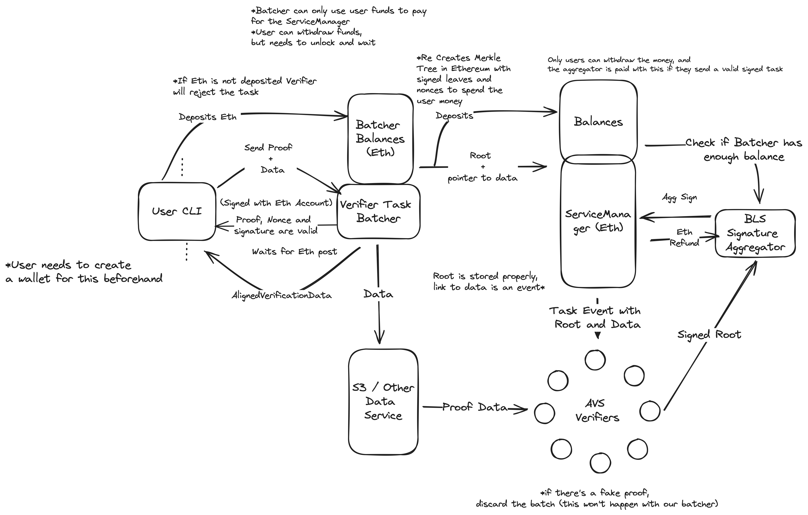
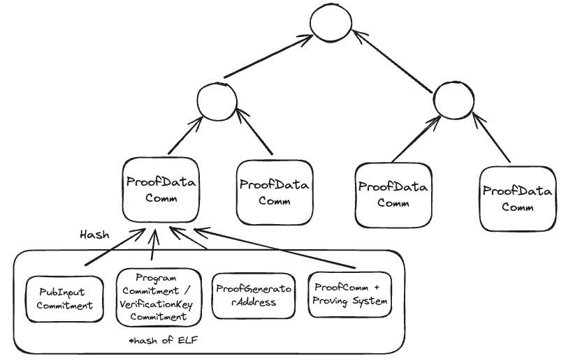
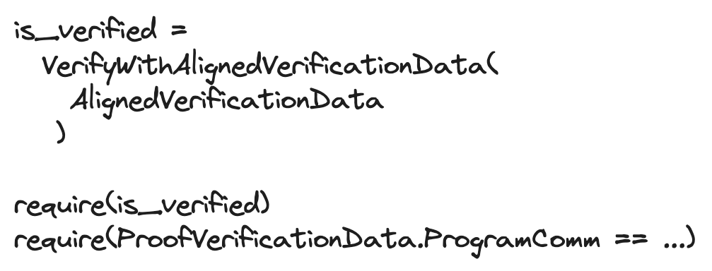
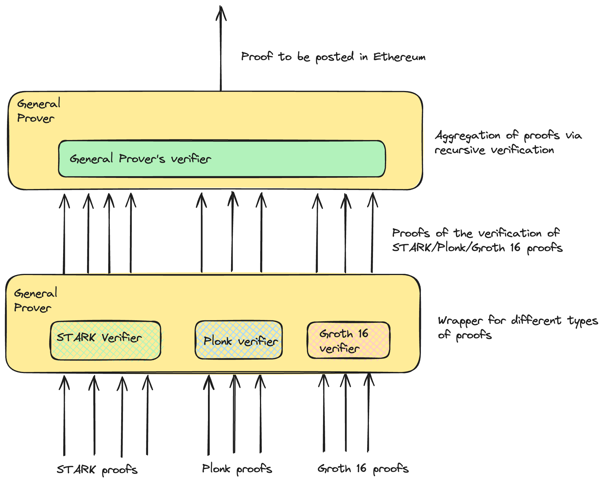
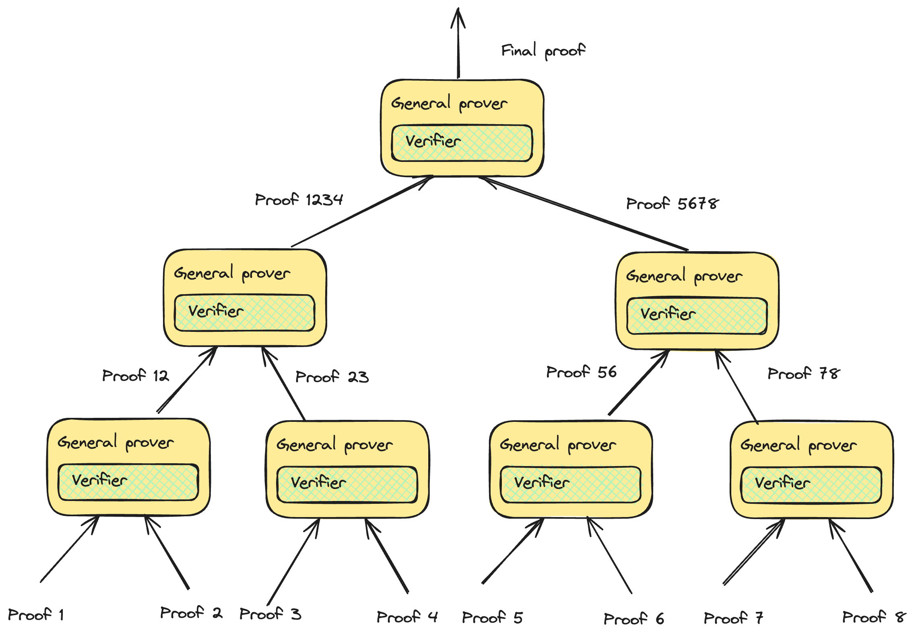

# How does Aligned work?

## Introduction

The advancement of proof systems over the last decade has allowed us to prove more complex computations, enabling new applications. The development of general-purpose virtual machines for proving programs written in languages such as Rust makes writing verifiable apps simpler, reducing costs and go-to-market time. However, high verification costs and low throughput remain a challenge that hinders further progress: only projects with enough capital or scale can afford the fees. In Ethereum, verification competes for blockspace with other applications; network congestion can result in higher costs. Most proof systems cost over 250,000 gas in Ethereum, and with the current gas cap set at 30,000,000, the EVM cannot process more than 100 proofs per block.

Aligned provides an alternative to significantly reduce costs and increase throughput. This is achieved by two different modes: the fast mode and the aggregation/slow mode. The fast mode works using a subset of Ethereum’s validators via restaking. Validators (also called Operators) receive proofs, verify them using the verification code written in Rust or another higher-level language, and sign messages with BLS signatures. If a two-thirds majority agrees, the results are posted to Ethereum. Since Aligned’s operators only need to run the verification code on bare metal, we have several advantages compared to running it on top of the EVM:

- The code can be optimized for speed, not gas consumption.
- We can leverage parallelization to increase throughput.
- Since the gas limit does not constrain us, we can verify proof systems that are too expensive for Ethereum, such as Kimchi or [Binius](https://eprint.iacr.org/2023/1784).
- Adding new proof systems is straightforward.

Preliminary numbers show that Aligned can verify more than 1000 proofs per second using our fast mode architecture, over two orders of magnitude greater than the EVM at nominal capacity. Using effective batching techniques, we can split the task creation and verification cost between thousands of proofs, greatly reducing costs.

The aggregation mode performs recursive proof verification to batch several proofs into a single one that will be verified on-chain. The validity of the final proof implies that the original proofs are also valid. The steps for this compression are:
- Conversion from the original proof system to a recursion-friendly proof system.
- Performing a reduction in the number of proofs using an n-ary tree (for simplicity, a binary tree).
- Convert the last proof into a low-cost proof system.

Rollups and aggregation layers usually follow this strategy; the main differences are in the choice of proof systems and proof conversion. For example, recursion-friendly proof systems are STARKs or Plonky, and low-cost proof systems include Groth16 or PLONK with KZG commitments.
We believe that efficient proving markets and verification networks are essential for accelerating the adoption of ZK technology by providing cost-effective solutions. Collectively, these advances set the foundation for the future of decentralized applications.

## Architecture
Aligned’s architecture is shown in the figure below:

The validators/AVS operators are responsible for proof verification. We also provide a light client to sample and check proofs at random. If there is a difference between Aligned’s results and the light clients, a proof service can trigger re-execution of the proof of Ethereum, leading to slashing if malicious behavior is detected.

### Components:

Aligned has the following components:

- User CLI: used to interact with the verifier task batcher. Sends proof and public input data and receives the verification data in Aligned.
- Verifier Task Batcher: Receives tasks from users, creates batches of tasks, publishes the proof and public data in the Data service, and sends the batches’ data to Ethereum. This service is permissionless, meaning users have the option to run their own batcher.
- Service Manager (Ethereum smart contract): Receives the batches’ data and signatures from the BLS signature aggregator. This contract provides information to validators and light clients on the batches/tasks.
- Data service: temporarily stores the data for the proof and public input.
- Operators: responsible for performing the verification of the proofs in each batch and signing messages with the results.
- BLS signature aggregator: receives the signatures from the operators, checks that there is quorum, and performs the aggregation of the signatures.
- Light client: samples random tasks from the Service Manager, checks the proofs, and compares against the results posted to Ethereum by Aligned. If there are differences, it can trigger an L1 verification via the proof service. In case of malicious behavior by Aligned’s operators this would lead to slashing.
- Proof service: receives results from the light clients; in case there are differences with the results posted by Aligned, it triggers a re-verification on Ethereum. Note that this re-verification can also be triggered by any user.
- Proof aggregator: Once tasks have been verified by Aligned’s operators, this component performs recursive proof verification to create one proof that will attest to the validity of all proofs contained in the batch. This proof is verified on-chain.

### Flow for sending a proof and publishing the result on Ethereum (Fast Mode)
The flow for sending a proof and having the results on Ethereum is as follows:
1. Using our CLI or SDK, the user sends one proof (or many) to the batcher.
2. The batcher answers with a ProofVerificationData for each proof.
3. The user invokes an IsVerified function with this data in Solidity to check that the proof is valid.
4. ( Optional ) The user checks that the commitment to the proven program matches the one it expects.

### Full flow with internals of the proof (Fast Mode)

1. The user uses a provided CLI or SDK to send one proof or many to the batcher, and waits (Alternatively, the user can run a batcher or interact directly with Ethereum)
2. The batcher accumulates proofs of many users for a small number of blocks (typically 1-3).
3. The batcher creates a Merkle Tree with commitments to all the data submitted by users, uploads the proofs to the Data Service, and creates the verification task in the ServiceManager.
4. The operators, using the data in Ethereum, download the proofs from the DataService. They then verify that the Merkle root is equal to the one in Ethereum, and verifies all the proofs.
5. If the proofs are valid, they sign the root and send this to the BLS signature aggregator.
6. The signature aggregator accumulates the signed responses until reaching the quorum, then sends the aggregated signature to Ethereum.
7. Ethereum verifies the aggregated signatures and changes the state of the batch to verified.

### Batch structure
The task batch consists of a Merkle tree containing the relevant information for proof verification in the lower level leaves. The root of the Merkle tree is posted to Ethereum together with a pointer to where the data is stored. Each leaf contains the following information:
- A commitment to the public input of the proof.
- A commitment to the proof and information about the proof system.
- A commitment to the program or a commitment to the verification key (depending on the proof system used).
- The address of the proof’s generator/submitter (optional).

A diagram for the batch is shown on the figure below:

### Reading the results from Ethereum
Once the results from a batch have been checked on Ethereum, the Aligned contract is updated with the results. The user’s contract can query the Aligned contract to check whether the proof has been included in a successful batch.

Additionally, the contract needs to be set to receive only proofs of specific programs. For example, in an L2, this may be a specific program that represents the state transition of the blockchain.
In the contract, the code would look like this:

Optionally, a committed address can also be used, an example being if one wants to give an NFT or tokens to a user that submitted a proof. Depending on the application it may be needed or not.

## Aggregation mode 
  
General Prover/Verifier: Every several days, takes the proofs from the DA layer and generates a proof of the verification of all the proofs. The general prover can be based on the SP1, Risc0 or Nexus virtual machine, which is a virtual machine able to prove general Rust code. The proof of the verification of the proofs is done using the corresponding verifier codes in Rust. The verification can be done using a tree structure.

To aggregate all the proofs, in the first step, all proofs are transformed into proofs of execution of the virtual machine, achieving proof uniformity (see Figure 2). We can then shrink proof size by recursively proving the verification of proofs, as shown in the tree diagram (see Figure 3).

