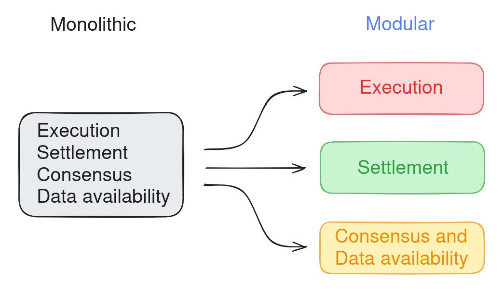
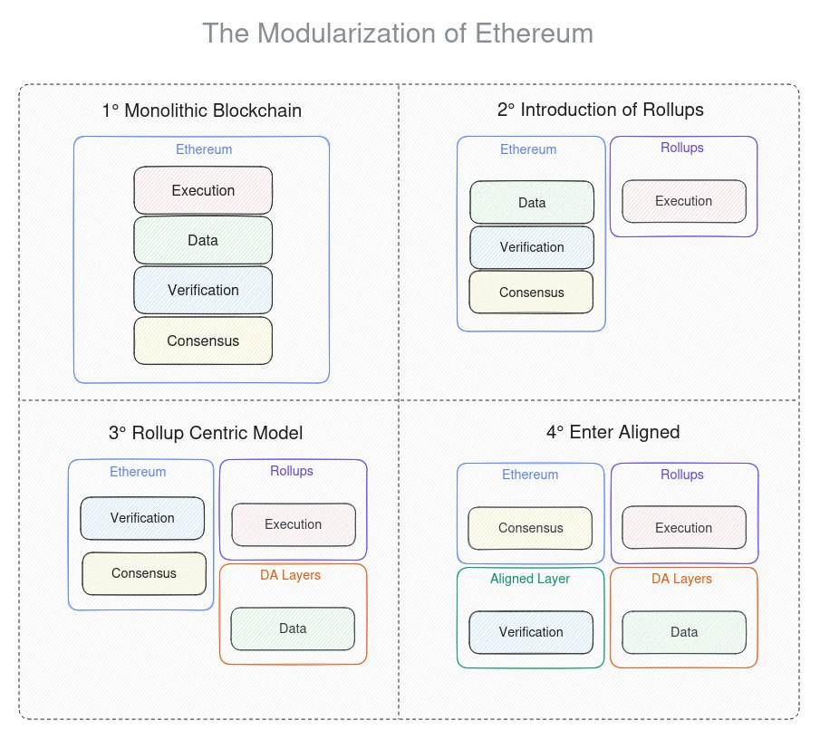
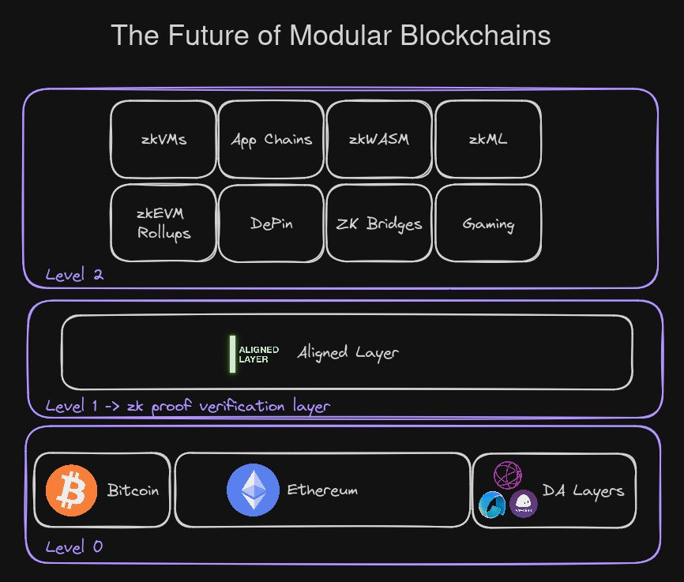

# Modular approach

As stated in the EigenLayer paper:

"Ethereum pioneered the concept of modular blockchains, where distributed applications (DApps) became modules that could be built permissionless on top of the Ethereum trust network".

In this context, the concept of modularity goes against the initial approach to constructing blockchains, the monolithic approach, in which a single blockchain is responsible for performing all tasks such as processing transactions, checking for accuracy, and getting nodes to agree on them. This working method gives rise to certain inherent problems when it comes to expansion, resulting in expensive hardware, limited control, and high overhead.

By introducing modularity to the blockchain, it enables the splitting up of its processes among multiple specialized layers. This approach has been used to create networks like rollups, a kind of scaling solution that processes transactions on other layer and then 'rolls' them up into batches for inclusion on the main blockchain. This helps lessen the strain on the main blockchain, resulting in faster and more cost-effective transactions, all while ensuring the security of the primary L1 chain remains intact.

The difference can be appreciated here:

In our case, with Aligned in the game, we are solving a simple problem: ZK verification. The EVM wasn't designed for that. So, we are creating another layer dedicated exclusively to verifying any proving system working outside the EVM, using the Ethereum consensus mechanism for security.

The entire modular Ethereum scheme will be as follows:

## Interaction with other blockchains.

Aligned could have more applications outside of Ethereum and help other blockchains verify proofs.

It is proposed that the future scheme work as follows:

As can be seen, at level 0 are Bitcoin, Ethereum, and DA Layers, Aligned would be at level 1 as a verification layer, and at level 2 the other layers, such as: AppChains, zkMLs, zkEVM Rollups, etc.
