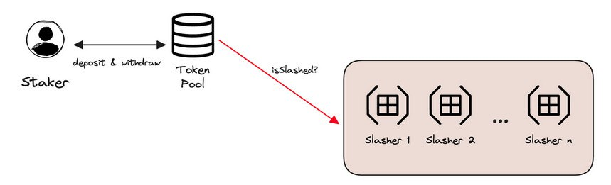

# Role of EigenLayer.

## What is EigenLayer?
EigenLayer is a set of smart contracts built on Ethereum that introduces restaking, it enables the reuse of ETH on the consensus layer to validate new software modules built on top of the Ethereum ecosystem. In this way, Ethereum stakers can help secure many services by providing pooled security, this occurs when multiple parties combine their resources to offer enhanced security for a system.

If you intend to build a decentralized infrastructure on Ethereum, ensuring its economic security is crucial. However, there is a problem: The design of Ethereum restricts the kinds of things that can be created.

To overcome these restrictions, you can:
 
1.	Create another layer without Ethereum's limitations.
2.	And ensure its security in some manner.

That's why we created Aligned Layer: a verification layer secured by the pooled security of Ethereum stakers.

## About Slashing mechanism.

Cryptoeconomic security quantifies the cost that someone must bear in order to cause a protocol to lose a desired security property. Referred to as the Cost-of-Corruption (CoC), if the expenses related to corruption are greater than any possible gains, the system is seen as having robust security.

EigenLayer ensures cryptoeconomic security through slashing mechanisms that impose a hefty cost on malicious behavior. Essentially, slashing can be likened to a financial penalty; it can be thought of as burning tokens.

With EigenLayer smart contracts holding the withdrawal credentials of Ethereum PoS stakers, any adversarial actions during participation in an AVS will result in the staker's ETH being slashed.

The enforcement of the staker's commitment and stakes takes place on the Ethereum platform, therefore the slashing mechanism is also carried out through smart contracts on Ethereum. In the event of a breach of commitment by the staker, evidence can be presented to the slashing contract by anyone, resulting in the forfeiture of the dishonest staker's stake.

EigenLayer requires a trustless and programmable platform to enforce different staker commitments, and Ethereum is the most suitable for this. It holds the largest stake. The higher the amount staked, the more security and guarantees it provides to its users.

The objective is for the stakers to be able to provide security, empowering them to commit to effectively securing a range of infrastructure protocols. If a staker attempts to engage in fraudulent activities, evidence can be presented by anyone to punish the staker and that is used by us in Aligned Layer.
