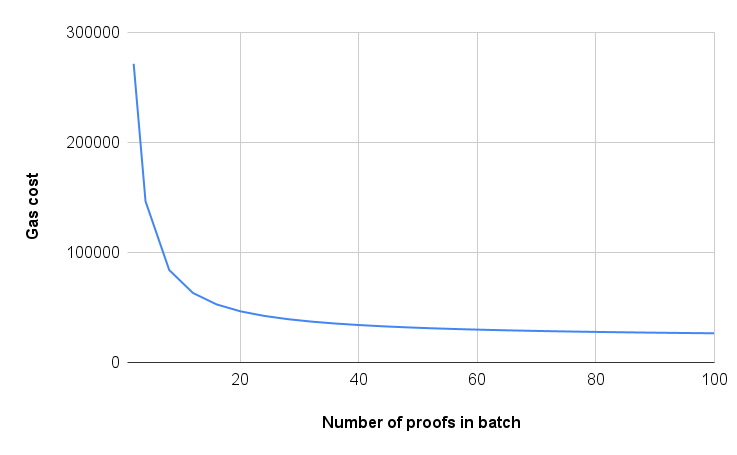

# Costs

## Current on chain verification costs

The verification of zero-knowledge proofs in Ethereum depends on the proof system used, proof size and additional data needed to verify such proofs. Some popular choices are Groth16, Plonk and STARKs. The cost to verify a proof (expressed in USD) depends both on the ether (ETH) to dollar conversion and the gas cost at a given time. The table below summarizes the gas cost and the cost in USD, assuming that the gas cost is 25 gwei/gas and ETH is worth 3,000 USD. These are just estimates, and the cost can fluctuate significantly, depending on network congestion and variations in the value of ETH.

| Proof system | Gas cost    | Cost in USD |
| --------     | --------    | --------    |
| Groth16      | 250,000     | 18.75       |
| Plonk/KZG    | 450,000     | 30.00       |
| STARKs       | >1,000,000  | >75         |

Note that these costs can vary depending on variants in the proof system (such as supporting lookup arguments or customized gates), the implementation of the smart contract in Ethereum, as well as the factors mentioned above. The annualized costs depend on the number of proofs the application needs to verify in one year. These costs just refer to the verification and do not take into account other costs the project incurs in Ethereum.

The following table summarizes the cost (is USD per year) as a function of the number of proofs sent in one day (24 proofs per day means that we send one proof every hour):

| Proofs per day | 12          | 24          | 48            | 96         | 
| --------       | --------    | --------    | --------      | --------   | 
| Groth16        |   82,125    |  164,250    |  328,500      | 757,000    |
| Plonk/KZG      |   131,400   |  262,800    |  525,600      | 1,051,200  |
| STARKs         |   328,500   |  657,000    | 1,314,000     | 2,628,000  |

These costs are high for many ZK projects in Ethereum.

## Costs in Aligned

The costs depend on task creation, aggregated signature or proof verification, and reading the results. The cost C per proof by batching N proofs is roughly:
    
$$
  C =\frac{C_{task} + C_{verification}}{N} + C_{read}
$$

The cost in USD will be obtained by multiplying this cost $C$ by the gas cost at the time of the verification, and the conversion factor from Ether to USD.

It is important to note that this cost is independent of the proof system used and of the proof size.

The estimates for these costs (in gas) are:

$C_{task} = 100,000 + 1,325 N$

$C_{verification} = 400,000$

$C_{read} = 20,000$

These numbers can be improved with changes on the contracts and other strategies. We are working on optimizations to reduce reading and verification costs. The following table summarizes the cost in terms of the number of proofs verified in a batch, $N$:

| $N$      | Gas cost | 
| -------- | -------- | 
| 1        | 521,325  | 
| 2        | 271,325  |
| 4        | 146,325  |
| 8        |  83,825  |
| 16       |  52,575  |
| 32       |  36,950  |
| 128      |  25,231  |

## Savings

Batching 8 proofs already produces significant savings compared to on-chain proof verification. It is important to note that we can batch proofs from any proof system, and without needing to do any further expensive steps, such as proof recursion. The table below summarizes the savings for Groth16 (in all other cases, the savings are higher. For STARKs, it can be 99%!):

| $N$      | Savings (%) | 
| -------- | --------    | 
| 4        |  41         |
| 8        |  66         |
| 16       |  79         |
| 32       |  85         |
| 128      |  90         |