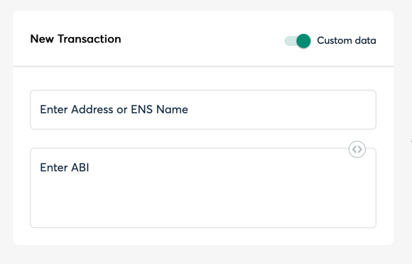

This file temporarily holds the previous multisig docs:

## Multisig Usage

> [!WARNING]  
> Safe Multisig Wallet is not currently supported in Holesky Testnet.

You can create a Multisig wallet using [Safe](https://safe.global/).

Once you have a Multisig, you can deploy the contracts using the Multisig wallet address as the upgrader, pauser, etc.

In order to upgrade a contract using the Multisig, you have to run:

```bash
make upgrade_aligned_contracts
```

Then, if the new implementation is correctly deployed, the script will show the following message:

```bash
You can propose the upgrade transaction with the multisig using this calldata
<calldata>
```

You can use this calldata to send the transaction using the Multisig wallet in the transaction builder provided by Safe



For example, if you are upgrading the ServiceManager, fill the data with the ProxyAdmin address and ABI

To get the ProxyAdmin address for Holesky you can run

```bash
jq -r ".addresses.alignedLayerProxyAdmin" contracts/script/output/holesky/alignedlayer_deployment_output.json | pbcopy
```

To get the ABI you can run

```bash
jq ".abi" contracts/out/ProxyAdmin.sol/ProxyAdmin.json | pbcopy
```

Then, you can paste the ABI in the ABI field


If the transaction is correctly created, you have to wait until required Multisig member sign the transaction to send it